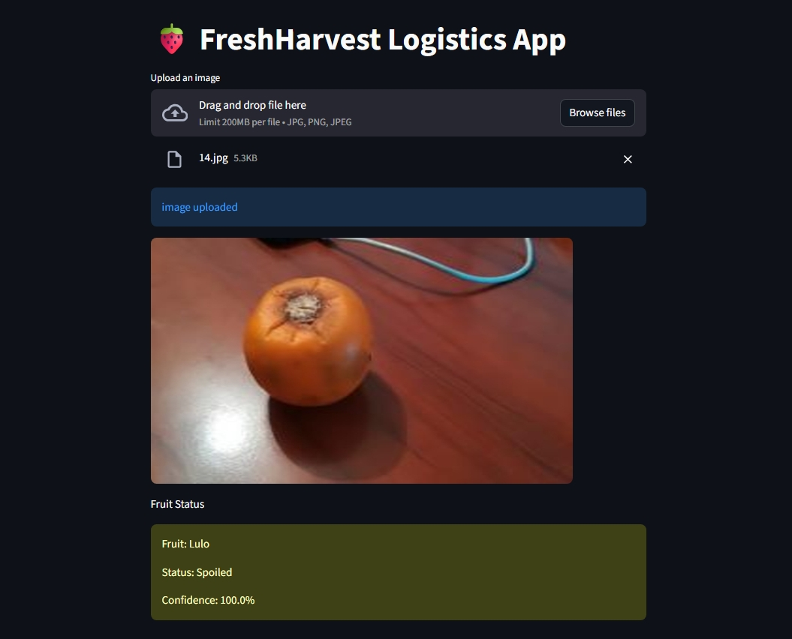

# 🍓 FreshHarvest Logistics App

It is an AI-powered image classification for Freshness of Fruit  
The APP identifies fruit type and assesses freshness.
Just drag and drop a  photo of fruit and get an instant prediction identifies fruit type and assesses freshness.  
---
### 🚨 Real-World Scenario
FreshHarvest Logistics, a major cold storage provider in California, faced recurring issues with manual fruit inspections—leading to spoiled produce slipping through and impacting food safety.
##### Solution
A warehouse staff member uploads a photo of a strawberry. The APP instantly responds:

Fruit: Strawberry Status: Soiled Confidence 97 %
### 🚀 Overview
The APP enables users to:

📸 Identify the type of fruit from an image

✅ Determine whether the fruit is fresh or soiled

🧠 Provide real-time feedback to warehouse staff or integrated systems
### 🏷️ Badges


[](https://share.streamlit.io/your-username/your-repo)


---

### 📸 Demo

  


---

### 🧠 Model Details

- **Base architecture**: ResNet50 (transfer learning)  
- **Training data**: ~1,700 labeled images  
- **Target classes (16)**:
  - F_Banana
  - F_Lemon
  - F_Lulo
  - F_Mango
  - F_Orange
  - F_Strawberry
  - F_Tamarillo
  - F_Tomato
  - S_Banana
  - S_Banana
  - S_Lemon
  - S_Lulo
  - S_Mango
  - S_Orange
  - S_Strawberry
  - S_Tamarillo
  - S_Tomato
- **Validation accuracy**: ~97%

---

### ⚙️ Features

- Drag-and-drop image upload
- Real-time damage classification
- Clear class labels and confidence score
- Lightweight inference suitable for local deployment or small cloud instances

---

## 🚀 Quick Start
### 1. Install the dependencies:
     
```bash
  pip install -r requirements.txt
```
   
### 2. Run the streamlit app:
```bash
  streamlit run app.py
